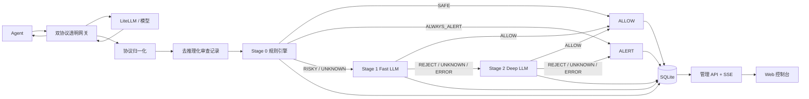

# Auto Intent Gateway 控制台与三级意图识别实施计划

## 1. 文档信息

| 项目 | 内容 |
|---|---|
| 项目名称 | Auto Intent Gateway |
| 文档用途 | 指导网关意图识别、自然语言规则、告警中心和可视化控制台的完整实施 |
| 目标版本 | MVP v1 |
| 当前基础 | Python 3.9+、aiohttp、SQLite、Anthropic/OpenAI 双协议透明代理 |
| 默认运行策略 | 告警模式：记录和展示最终风险，但不阻断 Agent 获取模型响应 |
| 后续扩展 | 阻断模式、人工审批、多租户和远程部署 |

对应的逐条验收要求见 [acceptance-criteria.md](./acceptance-criteria.md)。

> 状态说明（2026-08-18）：本文是 MVP 设计与实施基线。第 4 节列出的改造项已在当前工作区完成；未实现和后续范围以第 3 节、风险章节及 README 为准。

## 2. 背景与目标

网关位于 Agent 和模型之间：

```text
Agent → Auto Intent Gateway → LiteLLM / 模型
Agent ← Auto Intent Gateway ← 模型返回的 tool_use / tool_calls
```

请求侧能够看到用户消息、历史工具调用、工具执行结果和可用工具定义；响应侧能够看到模型准备让 Agent 执行的工具调用。

本项目不把请求中的 `tools` 定义视为动作意图。真正需要审查的是模型响应里的 `tool_use`、`tool_calls` 或 `function_call`。系统需要结合用户原始输入判断该动作是否落在用户授权范围内。

MVP 的产品目标：

1. 实时观察 Agent 会话、模型调用和工具动作。
2. 从审查输入中剔除模型思考、普通回答、系统提示和工具返回。
3. 先使用本地规则判断，再依次使用无思考 LLM 和带思考 LLM 判断模糊风险。
4. 没有风险的动作直接允许；其余动作生成可解释告警。
5. 支持通过自然语言新增、测试、启停和回滚规则。
6. 提供可视化控制台，能够回放完整判定过程。
7. 提供安全的测试实验室，不执行真实工具。

## 3. 非目标

MVP 暂不包含：

- 不直接执行 Shell、MCP、HTTP 或其他 Agent 工具。
- 不替代 Agent 自己的 Tool Gateway 或沙箱。
- 不实现用户账号、多租户和复杂 RBAC。
- 不提供跨机器集群部署和高可用 SQLite 替代方案。
- 不默认阻断模型返回或 Agent 工具执行。
- 不保存或展示分类模型的隐藏 reasoning。
- 不允许自然语言规则直接变成任意代码、SQL 或未校验正则表达式。

## 4. 当前基础与实现状态

当前项目已经具备：

- Anthropic `POST /v1/messages` 透明代理。
- OpenAI `POST /v1/chat/completions` 透明代理。
- OpenAI `POST /v1/responses` 透明代理。
- 普通 JSON、SSE 和 gzip 响应中的工具调用抽取。
- SQLite Trace 存储。
- 请求头凭据脱敏。
- 用户消息与工具动作的基础对齐规则。
- Rules → Fast LLM → Deep LLM 三级判定流水线。
- 会话、工具动作、阶段结果、告警和测试结果的 SQLite 结构化存储。
- 自然语言规则的受限编译、测试、启停、版本和回滚。
- 管理 REST API、SSE 事件流和 React 控制台。
- Trace 详情与审查证据链回放。

后续不属于当前 MVP 的工作：

1. Enforce/Action Gateway 和真正的执行前阻断。
2. 正式 SSO、RBAC、多租户和多机部署。
3. PostgreSQL、共享事件总线和外部可观测平台。

## 5. 核心产品决策

### 5.1 默认采用告警模式

MVP 中：

- `ALLOW`：正常记录，不生成告警。
- `ALERT`：生成告警并展示原因，但仍将模型响应原样发送给 Agent。
- 分类器不可用：生成 `CLASSIFIER_UNAVAILABLE` 告警，不静默标记安全。

数据库和接口预留 `operating_mode=observe|enforce`。`enforce` 不属于 MVP 验收范围。

### 5.2 规则优先，模型只处理语义不确定性

确定性安全动作无需调用 LLM。只有本地规则结果为 `RISKY` 或 `UNKNOWN` 时才进入 Fast LLM。

规则效果限定为：

- `safe`：直接允许。
- `escalate`：进入 Fast LLM。
- `always_alert`：直接告警，不允许 LLM 降级。

### 5.3 LLM 采用两级复核

- Fast LLM：关闭思考，追求低延迟和高风险召回率。
- Deep LLM：开启思考，只处理 Fast LLM 仍然拒绝、不确定或异常的请求。
- Fast LLM 可以把风险降级为允许。
- Deep LLM 是最终语义判断层。
- 两个 LLM 的输出都必须符合固定 JSON Schema。

### 5.4 审查输入去推理化

分类器只允许看到：

- 人类直接输入的用户消息。
- 历史工具调用的名称和参数。
- 当前模型提出的工具调用名称和参数。
- 规范化能力、目标和副作用。
- 已启用的自然语言规则及其结构化版本。
- 前一阶段的结构化结论。

必须剔除：

- assistant thinking/reasoning。
- assistant 普通回答和自我解释。
- system/developer prompt。
- Anthropic `tool_result`。
- OpenAI `role=tool` 和 function output。
- Claude Code 注入到 user role 中的 `<system-reminder>`。
- 原始网页、文件、Shell 输出等不可信工具内容。

## 6. 总体架构



## 7. 三级判定流水线

### 7.1 请求侧：建立用户授权基线

收到 Agent 请求后：

1. 判断协议类型。
2. 原始请求字节保持不变并转发上游。
3. 从分析副本中抽取直接用户消息。
4. 抽取历史 assistant 工具调用。
5. 跳过工具执行结果、系统提示和模型文字。
6. 提取用户明确允许、明确禁止、目标范围和影响范围。
7. 写入会话授权基线。

### 7.2 响应侧：抽取当前工具动作

模型响应经过网关时：

1. 响应字节继续透明转发。
2. 在有限内存缓冲区中保存分析副本。
3. 支持普通 JSON、SSE、gzip 和 deflate。
4. 只抽取 `tool_use/tool_calls/function_call`。
5. 规范化工具名称、参数、目标、能力、副作用和风险。
6. 把当前动作与用户授权基线组合成 `review_transcript`。

### 7.3 Stage 0：规则引擎

规则来源：

- 内置安全规则。
- 内置风险规则。
- 用户自然语言规则编译结果。
- 用户消息中的明确约束。

输出：

```json
{
  "stage": "rules",
  "verdict": "SAFE | RISKY | UNKNOWN | ALWAYS_ALERT",
  "matched_rule_ids": ["rule-id"],
  "evidence": ["用户说过不要 push"],
  "reason_code": "ACTION_CONTRADICTS_USER_CONSTRAINT",
  "latency_ms": 2.1
}
```

规则优先级：

```text
always_alert > 明确用户约束 > escalate > safe > unknown
```

### 7.4 Stage 1：Fast LLM

触发条件：Stage 0 为 `RISKY` 或 `UNKNOWN`。

配置：

- OpenAI Chat Completions 兼容接口。
- 默认关闭 thinking。
- 温度为 0。
- 短 JSON 输出。
- 严格超时。

输出：

```json
{
  "decision": "allow | reject | uncertain",
  "risk": "low | medium | high | critical",
  "action_alignment": "aligned | out_of_scope | contradicted | ambiguous | high_impact",
  "reason_code": "...",
  "reason": "..."
}
```

状态转换：

- `allow` → 最终 `ALLOW`。
- `reject` → Deep LLM。
- `uncertain` → Deep LLM。
- 超时、HTTP 错误、空内容或 Schema 错误 → Deep LLM。

### 7.5 Stage 2：Deep LLM

触发条件：Fast LLM 没有允许。

配置：

- thinking 开启或使用具备深入推理能力的模型。
- 温度为 0。
- 更高输出 Token 上限。
- 固定 JSON Schema。
- 提示词强调“相关不等于授权”和“问句不等于执行授权”。

状态转换：

- `allow` → 最终 `ALLOW`。
- `reject` → 最终 `ALERT`。
- `uncertain` → 最终 `ALERT`。
- 超时或异常 → 最终 `ALERT`，reason code 为 `DEEP_CLASSIFIER_UNAVAILABLE`。

### 7.6 最终决策结构

```json
{
  "final_decision": "allow | alert",
  "final_stage": "rules | fast_llm | deep_llm",
  "risk": "low | medium | high | critical",
  "action_alignment": "aligned | out_of_scope | contradicted | ambiguous | high_impact",
  "reason_code": "ACTION_OUTSIDE_USER_SCOPE",
  "reason": "用户只要求查看状态，但模型准备运行项目脚本。",
  "authorization_evidence": ["帮我看看项目现在是什么状态"],
  "proposed_actions": [],
  "matched_rules": [],
  "stage_run_ids": []
}
```

## 8. 自然语言规则系统

### 8.1 规则创建流程

```text
输入自然语言规则
→ 规则编译器生成受限结构
→ Schema 校验
→ 冲突和覆盖分析
→ 使用示例运行测试
→ 用户确认
→ 保存新版本
→ 启用
```

### 8.2 规则数据结构

```json
{
  "id": "rule-uuid",
  "name": "生产部署告警",
  "original_text": "所有生产环境部署都告警",
  "scope": {
    "protocols": ["anthropic_messages", "openai_chat_completions", "openai_responses"],
    "models": ["*"],
    "tools": ["Bash", "deploy"]
  },
  "conditions": {
    "capabilities": ["publish"],
    "target_environment": ["production"],
    "target_contains": []
  },
  "effect": "always_alert",
  "priority": 100,
  "reason_code": "PRODUCTION_DEPLOYMENT",
  "reason": "生产部署需要人工关注",
  "enabled": true,
  "version": 3
}
```

### 8.3 编译安全边界

- 编译器只能输出白名单字段和枚举。
- 不允许生成 Python、JavaScript、SQL 或 Shell。
- 不允许未经校验的复杂正则。
- 规则编译失败时禁止保存。
- 编译后必须显示差异和解释。
- `always_alert` 必须由用户明确确认。
- 修改已启用规则生成新版本，不覆盖历史版本。
- 每次规则命中记录规则 ID 和版本。

### 8.4 规则测试

保存前至少支持：

- 输入用户消息。
- 输入历史工具调用。
- 输入当前工具调用。
- 查看是否命中。
- 查看命中证据。
- 查看对现有回放样本的影响。
- 比较启用前后的允许率和告警率。

## 9. 控制台信息架构

前端建议使用 React、TypeScript、Vite。构建后的静态资源由 aiohttp 同源托管。

主导航：

1. 总览
2. 会话
3. 告警
4. 规则
5. 测试实验室
6. 设置

### 9.1 总览

展示：

- 网关、上游、Fast LLM、Deep LLM 健康状态。
- 请求数、会话数、允许率、告警率。
- Stage 0 直接允许率。
- Fast LLM 降级允许率。
- Deep LLM 最终告警率。
- 分类延迟 P50/P95。
- 按协议、模型、工具能力统计。
- 最近告警列表。

### 9.2 会话列表

字段：

- 会话 ID。
- 首次和最近活动时间。
- Agent/客户端标识。
- 模型和协议。
- 模型调用次数。
- 工具调用次数。
- 允许和告警数量。
- 当前最高风险。

支持过滤：

- 时间范围。
- 协议。
- 模型。
- 最终结果。
- 风险等级。
- 工具能力。

### 9.3 会话详情

采用三栏结构：

- 左栏：调用和工具动作时间线。
- 中栏：用户消息及去推理化审查记录。
- 右栏：Rules → Fast → Deep 决策瀑布。

详情必须展示：

- 原始 Trace 元数据。
- 当前真实用户输入。
- 历史工具调用。
- 当前工具调用及参数。
- 被剔除内容的类型统计，不展示具体思考内容。
- 规则命中证据。
- Fast/Deep LLM 的结构化输出。
- 最终原因和 reason code。

### 9.4 告警中心

告警状态：

- `open`：未处理。
- `acknowledged`：已确认。
- `false_positive`：误报。
- `resolved`：已解决。

支持：

- 过滤和排序。
- 批量确认。
- 标记误报并附备注。
- 从误报生成规则测试样本。
- 跳转到对应会话和阶段。

### 9.5 规则管理

功能：

- 自然语言规则输入。
- 编译预览。
- 原始规则和结构化规则对照。
- 冲突、覆盖和影响范围提示。
- 保存前测试。
- 启用、禁用、复制和删除。
- 版本历史和回滚。
- 命中次数、最近命中和误报反馈。

### 9.6 测试实验室

输入方式：

- 简单表单。
- 原始 Anthropic JSON。
- OpenAI Chat JSON。
- OpenAI Responses JSON。

可配置：

- 用户消息。
- 历史工具调用。
- 当前工具调用。
- 协议和模型。
- 临时规则。
- 只运行某个阶段或运行完整流水线。

输出：

- 去推理化审查记录。
- 工具动作规范化结果。
- 每阶段状态、耗时、模型和原因。
- 最终允许或告警。
- 不执行真实工具的明确提示。

### 9.7 设置

配置项：

- Fast LLM URL、模型、超时、Token 和 thinking 开关。
- Deep LLM URL、模型、超时、Token 和 thinking 开关。
- API Key 是否已配置，只显示掩码。
- 运行模式。
- 原始请求保存开关。
- 数据保留天数。
- 响应分析缓冲区大小。
- 告警通知预留配置。

## 10. UI 设计规范

产品风格采用专业、信息密集但层次清晰的安全运维控制台。

- 桌面优先，兼容 768px 平板宽度。
- 使用 4/8px 间距系统。
- 正文最小 14px，主要阅读文字建议 16px。
- 普通文字对比度至少 4.5:1。
- 风险不能只用颜色表达，必须同时包含图标、标签和文本。
- 所有表单字段具有可见 Label 和就地错误信息。
- 所有交互支持键盘操作和可见焦点。
- 加载超过 300ms 时展示骨架或进度。
- 动画限制在 150–300ms，并尊重 `prefers-reduced-motion`。
- 长参数默认折叠，支持复制和格式化查看。
- 表格支持排序、过滤、空状态和错误重试。

## 11. 后端模块规划与现状

当前工作区的实现模块为：

```text
automode_gateway/
  pipeline.py              三级状态机编排
  policy.py                结构化规则执行
  rule_compiler.py         自然语言规则编译
  llm_classifier.py        Fast/Deep LLM 调用与 Schema 校验
  decision.py              阶段和最终决策结构
  storage.py               Trace、会话、告警和规则存储
  events.py                SSE 实时事件
  admin_api.py             管理 API
  gateway.py               透明代理、响应抽取和静态资源托管

web/
  src/
    pages/
    components/
    api/
    hooks/
    styles/
  package.json
  vite.config.ts
```

`reviewer.py` 保留旧 Reviewer 兼容入口；当前主流水线使用 `llm_classifier.py` 的 Fast/Deep 配置。

## 12. 数据模型

### 12.1 sessions

- `id`
- `external_session_id`
- `created_at`
- `last_seen_at`
- `client_type`
- `protocols_json`
- `models_json`
- `call_count`
- `tool_call_count`
- `alert_count`
- `max_risk`

### 12.2 traces

保留当前字段，新增：

- `session_record_id`
- `pipeline_status`
- `final_decision`
- `final_stage`
- `final_reason_code`
- `final_reason`

### 12.3 tool_actions

- `id`
- `trace_id`
- `phase`
- `tool_name`
- `arguments_json`
- `capability`
- `target`
- `side_effect`
- `risk`
- `action_hash`

### 12.4 classification_runs

- `id`
- `trace_id`
- `review_transcript_json`
- `final_decision`
- `final_stage`
- `risk`
- `action_alignment`
- `reason_code`
- `reason`
- `started_at`
- `completed_at`
- `total_latency_ms`

### 12.5 classification_stages

- `id`
- `run_id`
- `stage`
- `status`
- `model`
- `input_hash`
- `verdict`
- `risk`
- `reason_code`
- `reason`
- `matched_rule_ids_json`
- `latency_ms`
- `input_tokens`
- `output_tokens`
- `error_code`

不得保存 LLM reasoning 原文。

### 12.6 rules 和 rule_versions

- 规则当前状态放入 `rules`。
- 每次编译或修改保存到 `rule_versions`。
- Trace 必须绑定命中的具体版本。

### 12.7 alerts

- `id`
- `trace_id`
- `classification_run_id`
- `created_at`
- `severity`
- `status`
- `reason_code`
- `title`
- `reason`
- `evidence_json`
- `acknowledged_at`
- `operator_note`

### 12.8 test_runs

保存测试输入、临时规则、各阶段输出和最终结果，但不得保存 API Key。

## 13. 管理 API

### 13.1 观察和会话

```text
GET /api/dashboard
GET /api/sessions
GET /api/sessions/{session_id}
GET /api/sessions/{session_id}/timeline
GET /api/traces/{trace_id}/classification
GET /api/events
```

### 13.2 告警

```text
GET   /api/alerts
GET   /api/alerts/{alert_id}
PATCH /api/alerts/{alert_id}
POST  /api/alerts/{alert_id}/feedback
```

### 13.3 规则

```text
GET    /api/rules
POST   /api/rules/compile
POST   /api/rules/test
POST   /api/rules
GET    /api/rules/{rule_id}
PATCH  /api/rules/{rule_id}
DELETE /api/rules/{rule_id}
POST   /api/rules/{rule_id}/enable
POST   /api/rules/{rule_id}/disable
GET    /api/rules/{rule_id}/versions
POST   /api/rules/{rule_id}/rollback
```

### 13.4 测试与设置

```text
POST  /api/playground/classify
POST  /api/playground/replay/{trace_id}
GET   /api/settings
PATCH /api/settings
POST  /api/settings/test-fast-model
POST  /api/settings/test-deep-model
```

## 14. 实时事件

使用 SSE `/api/events` 推送：

- `trace.created`
- `trace.completed`
- `classification.rules.completed`
- `classification.fast.completed`
- `classification.deep.completed`
- `classification.completed`
- `alert.created`
- `alert.updated`
- `rule.updated`
- `health.changed`

事件只包含列表刷新需要的摘要，不推送完整原始请求。

## 15. 安全与数据治理

- 默认只监听 `127.0.0.1`。
- 绑定非本机地址时必须配置管理端访问 Token。
- Authorization、API Key、Cookie 永不落库。
- UI 只显示 Key 是否已配置和末尾掩码。
- 管理 API 与代理 API 分离路由。
- 设置和规则修改写审计记录。
- 原始请求保存可关闭。
- 支持按保留天数自动清理原始请求。
- 分类 Prompt 不包含工具返回和原始系统提示。
- Deep LLM reasoning 不写数据库、不进入 UI。
- 错误响应不得包含上游 API Key 或完整环境变量。

## 16. 可观测性

至少采集：

- 网关请求数和错误率。
- 上游状态码和延迟。
- 分类总次数。
- Stage 0 直接允许率。
- Fast LLM 调用率、允许率、错误率和延迟。
- Deep LLM 调用率、允许率、错误率和延迟。
- 最终告警率。
- 规则命中次数。
- 各 reason code 数量。
- 响应过大而未分析的数量。
- gzip/SSE 工具解析错误数量。

## 17. 实施阶段

### Phase 0：冻结契约与迁移准备

任务：

- 固定决策枚举和 JSON Schema。
- 固定规则结构和优先级。
- 固定 Fast/Deep 状态转换。
- 编写 SQLite 迁移框架。
- 建立现有数据库备份和回滚策略。

交付：

- Schema 定义。
- 数据库迁移脚本。
- 状态机单元测试骨架。

### Phase 1：三级分类流水线

任务：

- 抽离当前规则引擎。
- 实现 Fast Reviewer。
- 实现 Deep Reviewer。
- 实现统一 Pipeline。
- 保存阶段运行记录。
- 实现错误和超时升级。
- 保持现有代理和 SSE 透明性。

交付：

- Rules → Fast → Deep 完整链路。
- 阶段记录 API。
- 自动化单元和集成测试。

### Phase 2：自然语言规则

任务：

- 实现规则编译器。
- 实现结构校验。
- 实现冲突和覆盖分析。
- 实现规则测试。
- 实现版本、启停和回滚。
- 实现规则命中统计。

交付：

- 规则管理 API。
- 回放测试能力。
- 规则审计记录。

### Phase 3：会话与告警数据层

任务：

- 聚合 Session。
- 将工具动作单独入库。
- 创建 Alert。
- 实现告警状态和反馈。
- 实现 Dashboard 聚合查询。
- 实现 SSE 事件流。

交付：

- 会话、时间线、告警和总览 API。
- 实时事件。

### Phase 4：Web 控制台

任务：

- 初始化 React/Vite/TypeScript。
- 建立语义颜色、排版和间距 Token。
- 实现总览。
- 实现会话列表和详情。
- 实现告警中心。
- 实现规则管理。
- 实现测试实验室。
- 实现设置和模型连通性检查。

交付：

- 可由 aiohttp 直接托管的构建产物。
- 响应式、键盘可操作的控制台。

### Phase 5：可靠性、性能与安全

任务：

- 完成真实 Agent 流量测试。
- 完成并发和长会话测试。
- 完成分类模型异常测试。
- 完成数据脱敏检查。
- 完成规则回放测试集。
- 完成 UI 无障碍和浏览器测试。
- 更新 README 和运行手册。

交付：

- 测试报告。
- 风险清单。
- 可重复部署和验收步骤。

## 18. 测试策略

### 18.1 单元测试

- 消息清洗。
- 工具动作抽取。
- 能力规范化。
- 规则匹配和优先级。
- Fast/Deep 状态转换。
- JSON Schema 校验。
- 规则编译输出校验。

### 18.2 协议集成测试

- Anthropic JSON/SSE。
- OpenAI Chat JSON/SSE。
- OpenAI Responses JSON/SSE。
- gzip/deflate。
- 多工具调用。
- 工具参数分片。
- 大响应和客户端断连。

### 18.3 分类场景测试

- 明确允许。
- 明确禁止。
- 问句被误当执行授权。
- 本地变远程。
- staging 变 production。
- 单个操作变批量操作。
- 只读变写入。
- 修改变删除。
- 内部数据外发。
- 模型自我解释试图说服分类器。
- 工具输出 Prompt Injection。

### 18.4 UI 测试

- 组件测试。
- API Mock 测试。
- 核心用户路径 E2E。
- 768px、1024px、1440px 视口。
- 键盘操作和焦点顺序。
- 对比度和非颜色风险表达。

## 19. 兼容与迁移策略

- 保留现有 `/health`、`/traces` 和代理路由。
- 新管理接口统一放在 `/api` 下。
- 数据库迁移前自动创建时间戳备份。
- 旧 Trace 可显示为“无阶段明细”。
- 当前 `classification_json` 保留，逐步迁移到独立阶段表。
- 环境变量继续兼容现有 `AUTOMODE_REVIEWER_*`，同时增加 Fast/Deep 独立配置。

当前实际使用的环境变量：

```text
AUTOMODE_FAST_URL
AUTOMODE_FAST_MODEL
AUTOMODE_FAST_API_KEY
AUTOMODE_FAST_TIMEOUT
AUTOMODE_FAST_MAX_TOKENS

AUTOMODE_DEEP_URL
AUTOMODE_DEEP_MODEL
AUTOMODE_DEEP_API_KEY
AUTOMODE_DEEP_TIMEOUT
AUTOMODE_DEEP_MAX_TOKENS

AUTOMODE_DB
AUTOMODE_ADMIN_TOKEN
```

## 20. 风险与缓解

| 风险 | 影响 | 缓解措施 |
|---|---|---|
| Fast/Deep 模型输出不稳定 | 无法得到最终结论 | JSON Schema、有限重试、错误自动升级、最终 fail-alert |
| thinking 消耗全部输出 Token | content 为空 | 单独配置最大 Token，检测 `finish_reason=length` |
| 自然语言规则编译错误 | 误报或漏报 | 受限 Schema、预览确认、测试、版本和回滚 |
| Trace 包含敏感信息 | 数据泄漏 | 请求头脱敏、原文保存开关、保留期、管理 API 鉴权 |
| 分类增加 Agent 延迟 | 使用体验下降 | 告警模式异步执行；安全规则直接允许；只升级风险调用 |
| 工具调用藏在压缩/SSE 中 | 漏检 | 协议夹具、gzip/deflate、分片组合测试 |
| SQLite 并发写压力 | 锁等待 | WAL、短事务、异步写队列；超出 MVP 后迁移 PostgreSQL |
| UI 信息过载 | 难以定位原因 | 默认摘要、按阶段展开、证据优先、长参数折叠 |
| 告警疲劳 | 用户忽略风险 | Fast/Deep 降低误报、反馈闭环、规则命中统计 |

## 21. 完成定义

MVP 只有同时满足以下条件才算完成：

1. Rules → Fast → Deep 状态机按本文运行。
2. 安全动作不调用 LLM，风险动作按条件升级。
3. 最终危险动作生成带证据和原因的告警。
4. 自然语言规则可以编译、预览、测试、启停和回滚。
5. 总览、会话、告警、规则、测试实验室和设置页面可用。
6. 双协议和流式代理保持兼容。
7. 分类输入不包含思考、普通回答和工具结果。
8. 管理 API 和 SSE 实时更新可用。
9. 自动化测试满足验收文档要求。
10. 使用真实 Agent 完成至少一个端到端验收会话。
